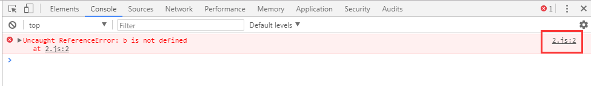

##  Gulp  Project1

1. 生成 package.json
命令行输入：
npm init
根据提示填写相关内容，简便起见，可一路按回车键。

2.  项目本地安装gulp
命令行输入：
npm install gulp --save-dev

3. 安装插件
npm install gulp-uglify gulp-watch-path stream-combiner2 gulp-sourcemaps gulp-minify-css gulp-autoprefixer gulp-less gulp-ruby-sass gulp-imagemin gulp-util --save-dev


### stream-combiner2

编辑 log.js 文件时，如果文件中有 js 语法错误时，gulp 会终止运行并报错。

例如当 log.js 缺少 )，即log('gulp-book'。
保存文件时出现如下错误，但是错误信息不全面。而且还会让 gulp 停止运行。
应对这种情况，我们可以使用 stream-combiner2 捕获错误信息。


**gulp-watch-path和stream-combiner2同时使用**

使用gulp-watch-path处理gulp.watch返回的事件，得到变化的路径，stream-combiner2对变化的文件进行处理


### gulp-sourcemaps 方法介绍

```
gulp.task('sourcemap',function() {
    gulp.src('./src/*.js')
    .pipe( sourceMap.init() )
    .pipe( concat('all.js') )
    .pipe( uglify() )
    .pipe( sourceMap.write('../maps/',{addComment: false}) )
    .pipe( gulp.dest('./dist/') )
})
```

- sourceMap.init( ) 启用sourcemaps功能
- sourceMap.write( ) 生成记录位置信息的sourcemaps文件
经过 concat 和 uglify ，将生成的all.js 与 源文件( src 下的所有js文件 )之间的位置映射信息，生成sourcemaps文件。
sourceMap.write( )，不传参，将会直接在 all.js 尾部，生成sourcemaps信息。
sourceMap.write( path )，将会在指定的 path，生成独立的sourcemaps信息文件。如果指定的是相对路径，是相对于 all.js 的路径。
addComment : true / false ; 是控制处理后的文件（本例是 all.js ），尾部是否显示关于sourcemaps信息的注释。
不加这个属性，默认是true。设置为false的话，就是不显示。如下：

```
var log=function(o){console.log("--------"),console.log(o),console.log("--------")};log({a:1});
//# sourceMappingURL=log.js.map    ----这里有 addComment

```

**sourcemaps 的使用**

谷歌浏览器中，打开开发者面板，点击右上角的设置。
在设置面板中 勾选 Enable JavaScript source maps 和 Enable CSS source maps。


如果 源码 2.js中有个bug，和其它 js 文件合并压缩成 all.js 文件。在一个html页面中，只引用这个 all.js。
在浏览器中，打开这个页面，控制台就会直接显示造成bug的源文件，点击即可看到报错位置。



